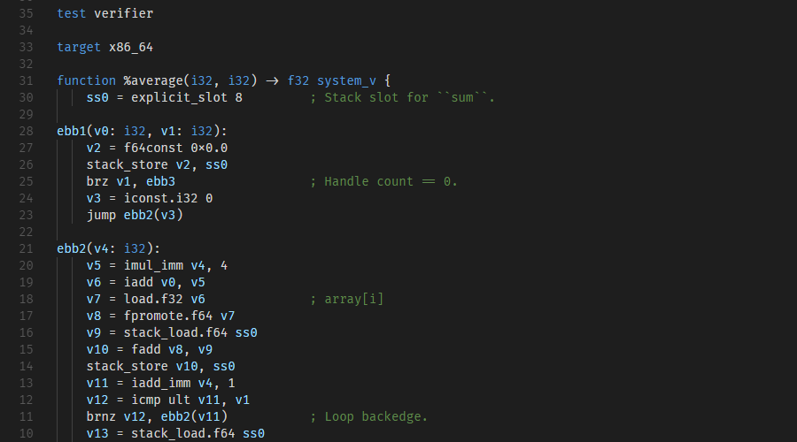
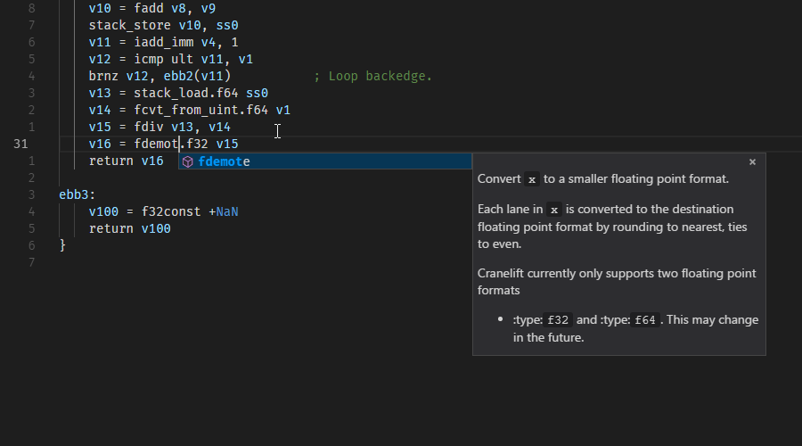
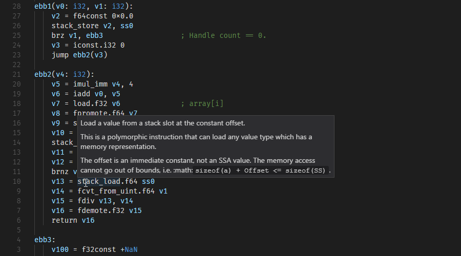

cranelift-vscode
================

[Cranelift](https://github.com/CraneStation/cranelift) IR support for
[Visual Studio Code](https://github.com/Microsoft/vscode).

## Features
- Syntax highlighting for `.clif` files.
- Completion of all instructions, with their documentation.
- Completion of all built-in types, with their documentation.
- Support for hover and signature helpers.
- Snippets.

## Screenshots

#### Syntax highlighting

#### Completion

#### Hover

